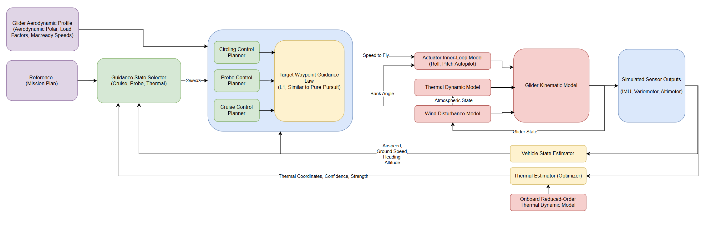

# AutoGlide
## Overview
AutoGlide is a full-stack GNC simulation for autonomous thermal soaring, featuring a kinematic ASK-21 glider model, online thermal estimation, and nonlinear guidance/control laws. The goal is to create a simulation of a glider within a convective environment that can autonomously locate and track a thermal updraft using only onboard sensors and compute, mirroring the challenges faced by real-world glider pilots. The project ultimately ended up being a fun way to explore non-linear control theory, optimal control, state estimation, and controller/estimator interactions. For a single thermal scenario, the glider is able to predict a thermal's parameters with a high degree of accuracy (~10% error) and thermal centering within 3m in simulation, allowing it to stay aloft indefinitely in a persistent thermal.

The project was inspired by my interest in gliding as a sport (as I am a glider pilot myself) and my desire to learn more about control theory and state estimation.

## Key Features
- **Physics-Based Glider Model (ASK21)**: Implements a realistic glider kinematic model based on the ASK21 glider, including key aerodynamics and sink rates.
- **Thermal Updraft Modelling**: Simulates thermal updrafts with realistic spatial and temporal variations, allowing the glider to interact with dynamic lift sources for robust controller development.
- **Multiple Guidance Control Laws**: Implements various guidance control laws, including probe, circling, and optimal speed-to-fly strategies, allowing the glider to adapt its flight path based on thermal conditions.
- **Online Thermal State Estimation**: Uses a optimization-based approach on windowed variometer data to estimate thermal parameters (strength, radius, center) in real-time, with a statistical-based confidence metric to ensure robust switching between guidance modes.
- **Monte Carlo Simulations**: Implements Monte Carlo simulations to evaluate the performance and robustness of the control algorithms under varying initial conditions and parameters, exposing potential weaknesses and failure modes.

## Table of Contents
- [Glider Model](glider_model/readme.md)
- [Thermal Model](thermal_model/readme.md)
- [Core Tracking Filter + State Estimator](thermal_estimator/readme.md)
- [Guidance Control Laws](controller/readme.md)
- [Monte Carlo Simulation + Analysis](monte_carlo/readme.md)
- [Learnings](learnings.md)
- [Development Notes](development.md)

## High Level Architecture

The architecture consists of several key components, with more details explained in the respective readmes. Note that for the scope of this project (single thermal tracking), the following components are not implemented but could be added in the future:
- Mission Plan (fixed on startup in this simulation)
- MacCready Speed-to-Fly (not implemented, but could be added to the controller)

## Future Work
Here are some random ideas and thoughts for extensions and future work that I wanted to capture.
- Windshear and wind gradient models
- Condor 2 Integration (Plug and Play with XCSoar UDP API, Virtual Joystick)
- Variometer modelling (lag dynamics)
- Wind estimation
- Replay real thermal data and see how well it would do

## Asides
This is a side project for the sake of learning and fun. It is not intended to be a project with production quality code or an example of best practice engineering - it's meant to be a sandbox for me to learn and experiment. AI was used to help generate some of the code and understand concepts presented in various research papers. If you find this project useful or interesting, please consider starring the repository!

## Intuition
Over this project I kept finding that intuition played a huge role in how the control and estimation came together. Circling in lift, picking a radius that balances sink rate with updraft strength, and realizing it really needs an online optimization all matched the “gut feel” I already had from flying. It was rewarding to see the physics-based glider and thermal models interact in a way that felt realistic — and even more satisfying, the controller often makes the same choices I do in the cockpit: flying slow, tight circles right on the edge of stall to maximize climb.