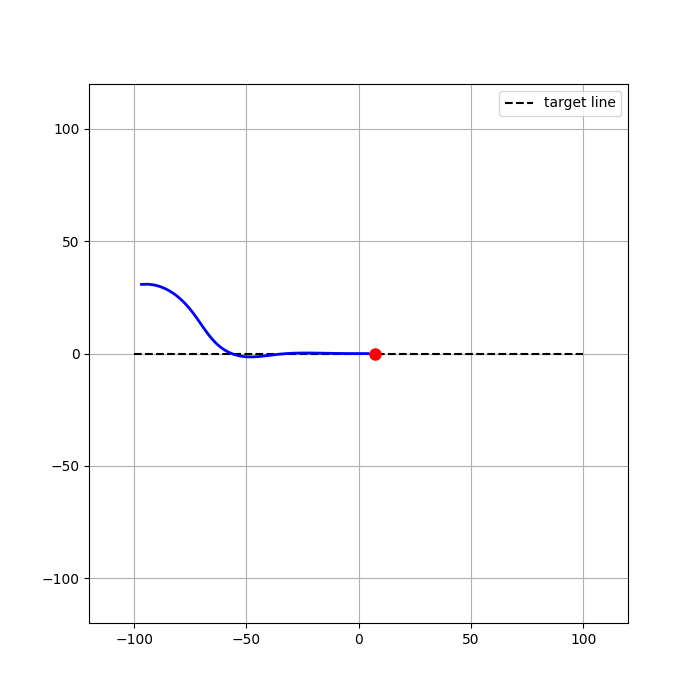
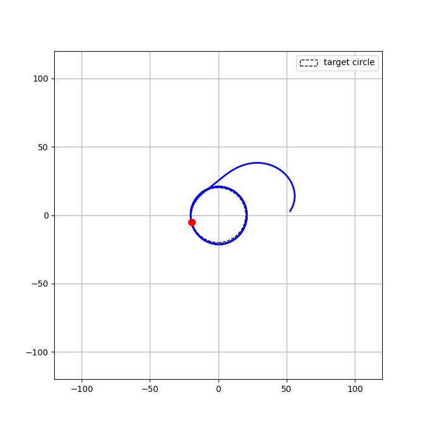

# Control Law
This directory contains the control law implementations.

## State Machine
The state machine (implemented in `state_machine.py`) determines the current flight mode of the glider. It listens to the estimator output and determines the appropriate law to use based on the glider's state and environment.
- Cruise: The glider flies straight ahead towards an objective waypoint.
- Probe: The glider performs a series of predetermined maneuvers to search for thermals. TBD: Circles? Figure-eights? Zig-zags?
- Thermal: The glider circles to stay within a thermal updraft.

All control modes use the same 

## L1 Guidance Control Law
The L1 guidance control law (implemented in `l1_guidance_law.py`) enables the glider to track arbitrary paths (expressed as waypoints). A good explanation of L1 guidance can be found in this [paper](https://mercury.kau.ac.kr/park/Archive/PCUAV/gnc_park_deyst_how.pdf). The key idea is that an acceleration command $a_{s,\text{cmd}}$ is computed based on the lateral error to the desired path's lookahead point. The below explanation is my summary of the key points from the paper that I found relevant in implementing the law.

The overall reason to use L1 guidance over pure pursuit (even though they are quite similar) is that L1 guidance takes into account the ground velocity vector of the glider and computes a lateral acceleration command with proven stability properties, whereas pure pursuit just computes a heading command to point toward the lookahead point. This becomes especially important in wind, since the glider’s ground velocity vector may not be aligned with its heading.

### Key Equations
The lateral acceleration command is given by:

$$
a_{s,\text{cmd}} = 2 \frac{V^2}{L_1} \sin(\eta)
$$

Where:
- $V$ is the current ground speed of the glider
- $L_1$ is the lookahead distance (a tunable parameter)
- $\eta$ is the angle between the glider's velocity vector and the vector from the glider to the lookahead point on the path

Note that this same law can be used to track straight lines and circular arcs. The difference is in how the lookahead point is computed.
For circular arcs, the paper proposes the following method to compute the lookahead point:
The centripetal acceleration required to follow a circular path of radius $R$ at speed $V$ is given by $a_c = \frac{V^2}{R}$. The lateral acceleration command can be set to this value to follow the arc. Rearranging the equation gives the required turn radius:

$$
\frac{V^2}{R} = 2 \frac{V^2}{L_1} \sin(\eta)
$$

$$
R = \frac{L_1}{2 \sin(\eta)}
$$

### Straight Line Path Tracking
For a straight line, the cross-track error $d$ is minimized by the above control law in a fashion similar to a gain-scheduled PD controller (equation 3). The gain scheduling comes from the fact that the velocity $V$ and lookahead distance $L_1$ can vary. For small angles, $\sin(\eta) \approx \eta$, and the acceleration command approximates to:

$$
a_{s,\text{cmd}} \approx 2 \frac{V^2}{L_1^2} \left( \frac{d}{L_1} + \frac{\dot{d}}{V} \right)
$$

Where
- $d$ is the cross-track error (lateral distance from the glider to the path)
- $\dot{d}$ is the rate of change of the cross-track error

The paper goes into more detail with regards to the stability analysis of this control law (particularly when the inner-loop dynamics are negligible, which is assumed for this guidance law) that is slightly underdamped ($zeta = 1/\sqrt{2}$).

### Straight Line with Perturbations
The analysis in the paper demonstrates that the control law behaves similar to the above PD controller on lateral offset when faced with perturbations in the path to track, although with a low-pass filter effect on the perturbations. This is important as it means that the glider can track a straight line path even in the presence of disturbances, whether these be due to wind gusts or trajectory perturbations.

### Bank Angle Mapping
Within the glider kinematic model, we see that lateral acceleration is related to the roll angle $\phi$ by:

$$
a_s = g \tan(\phi)
$$

Therefore, the bank angle command can be computed from the lateral acceleration command by:

$$
\phi_{\text{cmd}} = \tan^{-1}\left(\frac{a_{s,\text{cmd}}}{g}\right)
$$

## Circling Control Law
The circling control law (implemented in `circling_control_law.py`) uses the estimates from the thermal estimator to compute a desired circling radius and bank angle to stay within the thermal. The speed-to-fly and circling radius are solved from an optimization problem which attempts to maximize the climb rate $\dot{h}$ of the glider while accounting for the sink rate $v_s$ of the glider and the estimated vertical velocity profile $w(r)$ of the thermal. The optimization problem is given by:

$$
\underset{V, R}{\arg\max} \ \dot{h} \ = \ w(R) - v_s(V, \phi)
$$

Where:
- $w(R)$ is the estimated vertical velocity at radius $R$ from the thermal center
- $v_s(V, \phi)$ is the sink rate of the glider as a function of airspeed $V$ and bank angle $\phi$
- The bank angle $\phi$ is related to the circling radius $R$ and airspeed $V$ by:

$$
\phi = \tan^{-1}\left(\frac{V^2}{gR}\right)
$$

The optimization is solved numerically using SciPy's `minimize` function, and the resulting optimal circling radius is used by the L1 guidance law to track a circular path around the estimated thermal center. The optimal airspeed is used as the speed-to-fly command for the inner-loop speed controller.

Note that this is not accounting for the impact of wind on the circling path (i.e. airspeed is assumed to be equal to ground speed), which gives us a nice closed-form solution for the bank angle. While the L1 controller will still be able to track the circular path in wind, the analysis of optimal speed and bank to fly will be incorrect if the thermal is drifting at a different speed than the glider. This is a TODO for future work, but I don't expect it to be a significant issue in practice.

### Pictures
Photos of the simulation runs of only the L1 guidance law in line and circle modes are shown below:
#### Line Tracking

#### Circle Tracking

## Probe Control Law
The probe control law (implemented in `probe_control_law.py`) started as a placeholder, but I found out it worked quite well in practice. It currently calculates a vector from the glider's current position to the (low-confidence) estimated thermal center, and simply applies a bang-bang control law to turn the glider towards that point at a fixed bank angle. 

This turned out to be quite effective in practice, as the glider will turn towards the estimated thermal center and then start circling around it once the thermal estimator gains confidence in the estimate. The circling control law will then take over and optimize the circling radius and speed to fly. The Monte Carlo simulations show that the bang-bang probe control law generates zig-zag trajectories that effectively explore the area around the estimated thermal center, allowing the thermal estimator to converge to a good estimate of the thermal parameters in a fair amount of time.

The original idea behind this control law was to have the glider perform zig-zag maneuvers to search for thermals, and building a cost map of the area as it explores to determine where to best probe. This idea comes from the fact that glider pilots keep a mental map of where they found lift and where they have explored to inform how to probe for the thermal core. Usually, this involves turning whenever a thermal is detected and flying straight when no lift is detected. This is a TODO for future work if the need arises.

# TODO
In cruise mode, consider flying a MacCready speed based on the estimated average thermal strength and environmental sink rate.