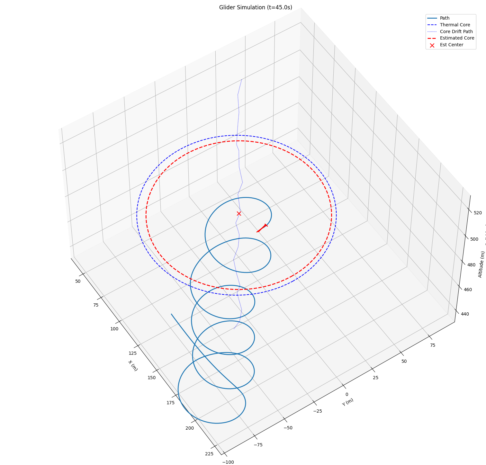

# Thermal Estimator
The goal of the thermal estimator model is to estimate the thermal core position and strength based on the glider's positions and vertical air velocity measurements. It uses an optimizer to minimize the difference between predicted and measured vertical air velocities. A Gaussian thermal model is assumed. A snippet of the estimator tracking a thermal is shown below:

## Optimization Variables
The variables optimized over are:
- $x_c, y_c$, the thermal core coordinates
- $W_0$, the thermal strength (maximum vertical air velocity at the core)
- $R_th$, the thermal radius (the distance from the core where the vertical air velocity drops to zero)

## Optimization Problem
The estimator uses a nonlinear optimization approach to minimize the residuals between the predicted and measured vertical air currents. The predicted vertical air velocity at the glider's position is given by a Gaussian thermal model:
$$
w_{pred}(x, y, x_c, y_c, W_0, R_{th}) = W_0 \exp\left(-\frac{(x - x_c)^2 + (y - y_c)^2}{R_{th}^2}\right)
$$

The cost function to minimize is the sum of squared differences between the predicted and measured vertical air velocities:
$$
J = \sum_{i=0}^{N - 1} \left(w_{pred}(x_i, y_i, x_c, y_c, W_0, R_{th}) - w_{meas,i}\right)^2 + \lambda_1 (W_0 - W_{0,prev})^2 + \lambda_2 (R_{th} - R_{th,prev})^2 + \lambda_3 ((x_c - x_{c,prev})^2 + (y_c - y_{c,prev})^2)
$$
Where $(x_i, y_i)$ are the glider's positions and $w_{meas,i}$ are the corresponding measured vertical air velocities (measured from variometer), with N being the total number of variometer measurements used in the estimation.

The terms with $\lambda_1, \lambda_2, \lambda_3$ are regularization terms to prevent large jumps in the estimated parameters between iterations. The previous estimates $W_{0,prev}, R_{th,prev}, x_{c,prev}, y_{c,prev}$ are used for this purpose.