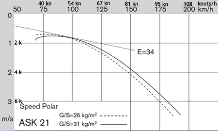

# Glider Model
The glider is assumed to be modeled as a point mass with a fixed kinematic model

## Variable Nomenclature
- \(x, y\): Position of the glider in a fixed 2D world frame (m)
- \(V\): Airspeed of the glider (m/s)
- \(\psi\): Heading angle of the glider (w.r.t. the x-axis) (rad)
- \(\phi\): Roll angle of the glider (rad)
- \(h\): Altitude of the glider (m)
- \(W_x, W_y\): Wind speed in the x and y directions (m/s)

## Function Nomenclature
- \(w(x, y)\): Thermal uplift strength at position (x, y) (m/s)
- \(s(V, \phi)\): Sink rate of the glider (m/s) - positive defined as downwards. 

### Sink Rate Model
The sink rate \(s(V, \phi)\) expresses how much altitude the glider loses based on the airspeed \(V\) and the roll angle \(\phi\). Usually found from the glider's polar curve. An example from an ASK-21 is given below here ([source](https://www.williamssoaring.com/fleet/ask21b-bm.html)) .

For simplicity, a quadratic model fitted around the min sink (defined as \(s_{min}\), at \(V^*\)). is used. \(s_0(V)\) is the sink rate at zero roll angle with the current airspeed, and \(k_v\) is a tuning parameter that defines how quickly the sink rate increases as the airspeed deviates from \(V^*\).
\[
    s_0(V) = s_{min} + k_v (V - V^*)^2
\]
Finally, this sink rate is adjusted for the roll angle \(\phi\) as there is less lift generated when the glider is banked. See the figure below for more details ([source](https://aviation.stackexchange.com/questions/19030/what-types-of-maneuvers-increase-the-load-factor-on-the-aircraft)). .  
For the purposes of this model, it's assumed that the sink rate increases proportionally to the load factor (\(n = \frac{1}{\cos(\phi)}\)) to the power of a tunable parameter \(\alpha_n\). There's a more complex relationship here, but keeping it simple since I'm not an aerodynamics expert.
\[
    s(V, \phi) = s_0(V) \cdot n^{\alpha_n} = s_0(V) \cdot \left(\frac{1}{\cos(\phi)}\right)^{\alpha_n}
\]

## Glider Kinematics Model
\[
\dot{x} = V \cos(\psi) + W_x
\]
\[
\dot{y} = V \sin(\psi) + W_y
\]
\[
\dot{\psi} = \frac{g}{V} \tan(\phi)
\]
\[
\dot{h} = w(x, y) - s(V, \phi)
\]
