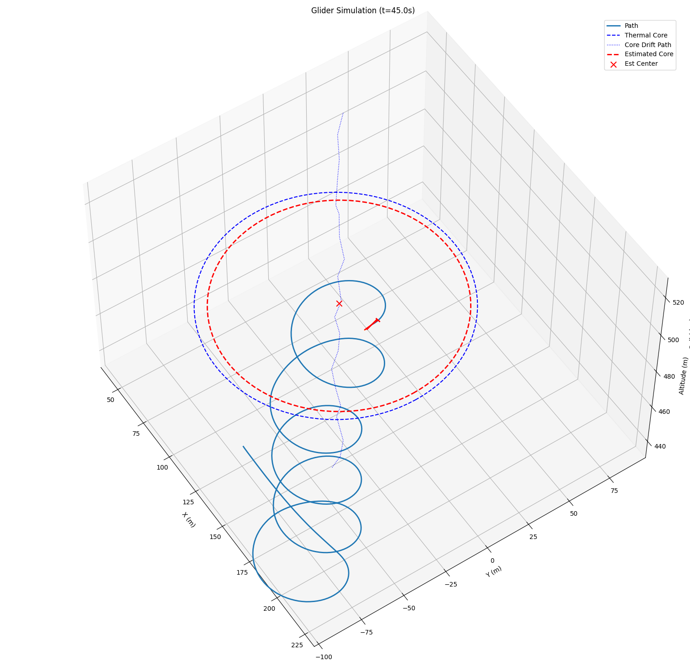

# Thermal Estimator
The goal of the thermal estimator model is to estimate the thermal core position and strength based on the glider's positions and vertical air velocity measurements. It uses an optimizer to minimize the difference between predicted and measured vertical air velocities. A Gaussian thermal model is assumed. A snippet of the estimator tracking a thermal is shown below:

## Optimization Variables
The variables optimized over are:
- $x_c, y_c$, the thermal core coordinates
- $W_0$, the thermal strength (maximum vertical air velocity at the core)
- $R_th$, the thermal radius (the distance from the core where the vertical air velocity drops to zero)

## Optimization Problem
The estimator uses a nonlinear optimization approach to minimize the residuals between the predicted and measured vertical air currents. The predicted vertical air velocity at the glider's position is given by a Gaussian thermal model:
$$
w_{pred}(x, y, x_c, y_c, W_0, R_{th}) = W_0 \exp\left(-\frac{(x - x_c)^2 + (y - y_c)^2}{R_{th}^2}\right)
$$

The cost function to minimize is the sum of squared differences between the predicted and measured vertical air velocities:
$$
J = \sum_{i=0}^{N - 1} \left(w_{pred}(x_i, y_i, x_c, y_c, W_0, R_{th}) - w_{meas,i}\right)^2 + \lambda_1 (W_0 - W_{0,prev})^2 + \lambda_2 (R_{th} - R_{th,prev})^2 + \lambda_3 ((x_c - x_{c,prev})^2 + (y_c - y_{c,prev})^2)
$$
Where $(x_i, y_i)$ are the glider's positions and $w_{meas,i}$ are the corresponding measured vertical air velocities (measured from variometer), with N being the total number of variometer measurements used in the estimation.

The terms with $\lambda_1, \lambda_2, \lambda_3$ are regularization terms to prevent large jumps in the estimated parameters between iterations. The previous estimates $W_{0,prev}, R_{th,prev}, x_{c,prev}, y_{c,prev}$ are used for this purpose.

## The Journey
Before settling on the above approach, I tried an Extended Kalman Filter (EKF) approach to estimate the thermal parameters as part of the state vector. The EKF had access to the actual position of the glider with no actual state dynamics, and the measurement model was the same Gaussian thermal model as above. Truthfully, I didn't have the best reason for using an EKF aside from it being a "first-reach" approach to the problem. When I implemented it, I found the EKF just wouldn't converge and keep increasing its covariance over time. 

I still want to come back and really understand why an EKF wasn't the right choice here (as I found I was using it as a nonlinear optimizer because of the lack of dynamics). My suspicion is that the problem is just not observable enough with the limited measurements available (intuition: only 1 measurement at a time, rather than a window of measurements with associated positions to act on - how can an EKF converge with so little information?). 

Resultingly, I switched to the nonlinear optimization approach above which worked much better in practice. The downside is that it requires a window of measurements to work with, rather than being able to update the estimate at each timestep. 

### Optimization Lessons Learned
I learned very quickly that regularization was key to getting the optimization to behave well. Without it, the estimates would jump around wildly between iterations, and it wasn't uncommon to have blips where the optimizer would solve to a completely incorrect solution with a different center, even though it tracked fine before. It was cool to see how adding the terms made the estimates much more stable at the expense of some phase lag in the estimates (basically, a low-pass filter effect).

Also, unlike a bayesian filter, the optimization doesn't provide any uncertainty estimates on the parameters. I ended up having to come up with my own measure of uncertainty, which attempts to match how well the model fits the observed variometer data. This is still a little rough around the edges, in particular when flying in complete sink (the model is technically right in saying that the thermal location is where it was last seen, but at that point the uncertainty has very little meaning).