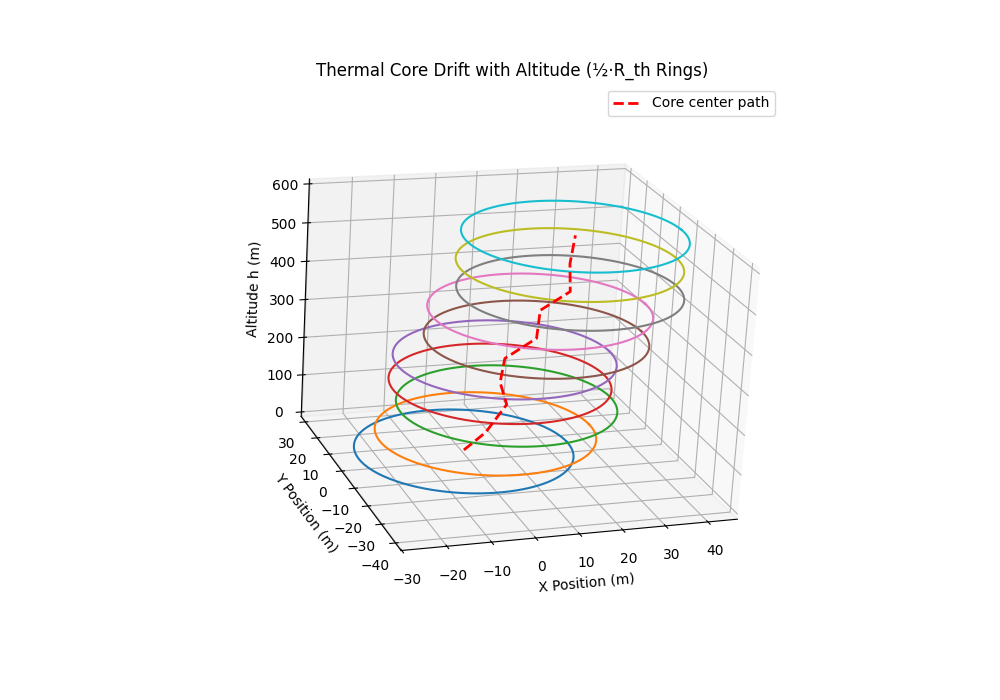

# Thermal Model
The thermal model is based on an equation I found in a NASA paper that attempts to solve a similar problem of [autonomous soaring for improved endurance of a small uninhabited air vehicle](https://ntrs.nasa.gov/api/citations/20050041655/downloads/20050041655.pdf). Equation 18 in the paper is reproduced below. Note this equation seems to have come from another paper from 1998, but I couldn't find that paper.

$$
w_{\text{pred}}(r) = \big(w_{th} + V_e\big) \;
    \exp\!\left[ -\left(\frac{r}{\max(r_{th},\,1)}\right)^2 \right]
    - V_e
$$

## Core Centering Model
The thermal core is assumed to drift linearly with altitude, with drift rates $k_x$ and $k_y$ in the x and y directions respectively. Additionally, a small random noise component is added to the core position at each altitude with zero mean.
The core center at altitude $h$ is given by:

$$
x_c(h) = x_{th} + k_x \cdot h + \eta_x(h)
$$

$$
y_c(h) = y_{th} + k_y \cdot h + \eta_y(h)
$$

This simple model assumes a constant wind shear. It’s definitely not high fidelity, but it does capture the core idea of a linearly drifting thermal core with altitude.

## Variable Nomenclature

- $w_{\text{pred}}(r)$ = predicted vertical velocity (m/s) at distance $r$ from the thermal center  
- $w_{th}$ = maximum thermal updraft velocity (m/s)  
- $r_{th}$ = characteristic thermal radius (m)  
- $V_e$ = environmental sink velocity (m/s, constant)  
- $r = \sqrt{(x - x_c)^2 + (y - y_c)^2}$ = radial distance to thermal center  

## Model Plots
  

